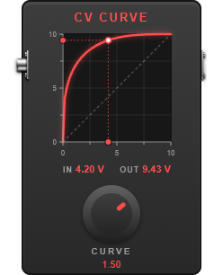

# CV Curve

[](https://github.com/Jesse-Hufstetler/mod-cv-curve/actions/workflows/build.yml)



An LV2 plugin for [MOD Devices](https://mod.audio/) hardware (built for the MOD Dwarf) that bends a control voltage (CV) along an adjustable curve.

With **Curve** at 0 the output follows the input exactly. Turn it one way and the output starts slowly and finishes fast; turn it the other way and it starts fast and eases off. Use it to give a footswitch ramp, an LFO or an envelope a more natural response before it drives a parameter. The pedal shows a live graph of the curve and redraws it as you turn the knob. Dots on the graph's voltage rulers follow the incoming and outgoing voltages, joined to the curve by thin guide lines, with the exact values shown underneath.

## Ports

| Port | Type | Range | Description |
|------|------|-------|-------------|
| CV Input | CV in | 0–10 V | The voltage to reshape |
| CV Output | CV out | 0–10 V | The reshaped voltage |
| Curve | Control in | −4 to +4 (default 0) | 0 is a straight line; positive and negative values bend it in opposite directions |
| Input Value | Control out | 0–10 V | The latest input voltage, so the pedal GUI can show it (a GUI cannot read a CV port) |
| Output Value | Control out | 0–10 V | The latest output voltage, for the same reason |

Whatever the curve, 0 V stays 0 V and 10 V stays 10 V, and the output never goes backwards as the input rises.

## How the curve works

The input is scaled to 0–1, bent with a superellipse-style curve whose exponent is set by **Curve**, and scaled back to 0–10 V. At **Curve** 0 the exponent is 1, which is exactly a straight line.

## Building and installing

The build uses the MOD plugin builder toolchain. `redeploy.sh` sources its environment, builds the plugin, and pushes the bundle to a Dwarf over USB networking:

```bash
./redeploy.sh
```

It expects `~/mod-plugin-builder` to be set up for the `moddwarf` target and the device to be reachable at `192.168.51.1`.

For a plain build with the host compiler:

```bash
make
sudo make install   # installs to /usr/local/lib/lv2
```

## Files

- `mod-cv-curve.c`: the plugin code
- `mod-cv-curve.lv2/`: the LV2 bundle (`mod-cv-curve.ttl` describes the ports, `modgui.ttl` the pedal GUI; `manifest.ttl` is generated from `manifest.ttl.in`)
- `mod-cv-curve.lv2/modgui/`: the pedal GUI (HTML template, stylesheet, the script that draws the graph, screenshot and thumbnail). The artwork is original to this project and drawn entirely in CSS and SVG.
- `Makefile`, `Makefile.mk`: build rules
- `redeploy.sh`: build and deploy to a MOD Dwarf
- `tools/rename-uri.sh`: changes the plugin URI in every file at once

## Plugin URI

The plugin's permanent ID is `https://jesse-hufstetler.github.io/plugins/mod-devel/eg-mod-cv-curve`. Pedalboards remember plugins by URI, so changing it makes existing pedalboards show the plugin as missing until it is re-added. If you do need to change it, `tools/rename-uri.sh <new-uri>` updates every file; rebuild afterwards.

## License

[MIT](LICENSE)
